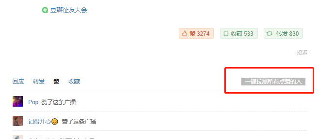
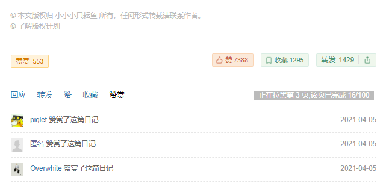
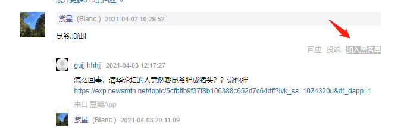
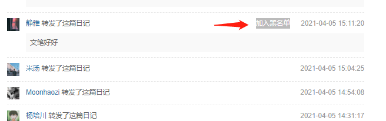
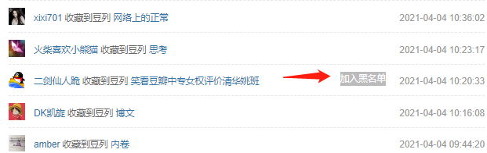
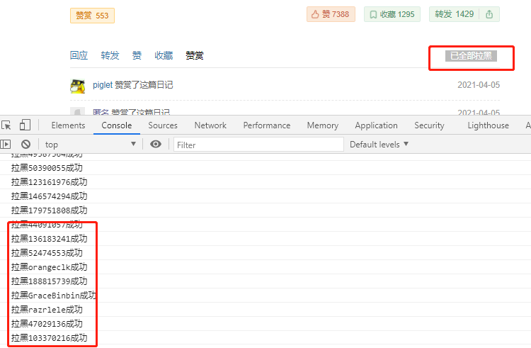

### 功能

在广播、日志 详情页 上增加一键拉黑功能 

* 点赞页一键拉黑所有人
* 赞赏页一键拉黑所有人
* 回复页 单人快速拉黑
* 转发页 单人快速拉黑
* 收藏页 单人快速拉黑

### 代码地址

[github.com/harryhare/userscirpt](https://github.com/harryhare/userscript/tree/master/douban_one_click_blacklist)

### 使用

见图片

---

---

---

---

---

